  

  

  
  
  
  

I build **React interfaces, component libraries and right-to-left layouts, and the Node.js APIs behind them.**

From 2022 to 2023 I worked full-time at [**freeCodeCamp**](https://github.com/freeCodeCamp), where I merged [**373 pull requests**](https://github.com/freeCodeCamp/freeCodeCamp/pulls?q=is%3Apr+author%3ASboonny+is%3Amerged) into the main repository. That was the most of any human contributor in that period, and every one was reviewed by the core team. Native Arabic speaker, so I care a lot about interfaces that work in both directions.

  

## What I've built

<table>
<tr>
<td width="50%" valign="top">

### Right-to-left layout for freeCodeCamp
Added RTL support to a float-based React client that had none, so Arabic learners get a native, mirrored interface. Then moved spacing to **CSS logical properties** so components work in both directions without overrides.

[**PR #48287**](https://github.com/freeCodeCamp/freeCodeCamp/pull/48287) · [#48769](https://github.com/freeCodeCamp/freeCodeCamp/pull/48769) · [all RTL PRs →](https://github.com/freeCodeCamp/freeCodeCamp/pulls?q=is%3Apr+author%3ASboonny+is%3Amerged+rtl)

</td>
<td width="50%" valign="top">

### freeCodeCamp's new API
Routes for the **Fastify + Prisma** API that replaced the legacy server: challenge saving, profile and settings, email flows, and retiring old endpoints. I also added **Sentry** error monitoring as a Fastify plugin.

[**PR #50040**](https://github.com/freeCodeCamp/freeCodeCamp/pull/50040) · [#49731](https://github.com/freeCodeCamp/freeCodeCamp/pull/49731) · [all 15 API PRs →](https://github.com/freeCodeCamp/freeCodeCamp/pulls?q=is%3Apr+author%3ASboonny+is%3Amerged+%22feat%28api%29%22)

</td>
</tr>
<tr>
<td width="50%" valign="top">

### Component library & Bootstrap migration
Built shared components (FormGroup, ControlLabel, Panel, Row/Col, theming) and replaced React-Bootstrap across the client **one component at a time**, while the site stayed live.

[**PR #50202**](https://github.com/freeCodeCamp/freeCodeCamp/pull/50202) · [#52011](https://github.com/freeCodeCamp/freeCodeCamp/pull/52011) · [#52372](https://github.com/freeCodeCamp/freeCodeCamp/pull/52372)

</td>
<td width="50%" valign="top">

### Chapter: 144 merged PRs
Full-stack work on freeCodeCamp's self-hosted event-management tool for nonprofits: dashboard search, paginated GraphQL queries, lazy loading, invite-only events and **screen-reader-friendly forms**.

[**PR #2301**](https://github.com/freeCodeCamp/chapter/pull/2301) · [#2352](https://github.com/freeCodeCamp/chapter/pull/2352) · [all Chapter PRs →](https://github.com/freeCodeCamp/chapter/pulls?q=is%3Apr+author%3ASboonny+is%3Amerged)

</td>
</tr>
</table>

## Open source beyond freeCodeCamp

| | Project | Contribution |
|:-:|---|---|
|  | [**create-t3-app**](https://github.com/t3-oss/create-t3-app/pulls?q=is%3Apr+author%3ASboonny+is%3Amerged) | 9 merged PRs: RTL layout fixes for the docs site and Arabic documentation |
|  | [**MUI X**](https://github.com/mui/mui-x/pull/11554) | DataGrid developer warnings for conflicting `autoPageSize` / `autoHeight` |
|  | [**TypeHero**](https://github.com/typehero/typehero/pull/1322) | Stopped checkboxes on challenge cards from triggering navigation |
|  | [**transition.css**](https://github.com/argyleink/transition.css/pull/31) | Added "cinematic" wipe in/out transitions |
|  | [**freeCodeCamp Arabic**](https://github.com/Sboonny/freeCodeCamp-Arabic-Translated-Articles) | Arabic translations; temporary Arabic language lead; forum & Discord moderator |

## Tech stack

**Frontend** 

**Backend & data** 

**Testing & tooling** 

## Recognition

> "Muhammed is a consummate developer with an encyclopedic knowledge of full stack development."
>
> — **Quincy Larson**, founder of freeCodeCamp, who managed Muhammed directly ([LinkedIn](https://www.linkedin.com/in/sboonny))

- Most merged pull requests of any human contributor to `freeCodeCamp/freeCodeCamp` in 2022–2023 (373)
- Temporary Arabic language lead for freeCodeCamp; moderator of its forum and Discord
- Total TypeScript: *Type Transformations* (2023), *TypeScript Generics* (2024)

## Get in touch

Open to remote **frontend** and **full-stack TypeScript** roles. Based in Egypt (UTC+3).

**Email:** [muhammedelruby@gmail.com](mailto:muhammedelruby@gmail.com) · **LinkedIn:** [linkedin.com/in/sboonny](https://www.linkedin.com/in/sboonny) · **Portfolio:** [sboonny.github.io/portfolio](https://sboonny.github.io/portfolio/)

Pull-request counts come from GitHub search of merged PRs authored by @Sboonny, checked September 2026.
